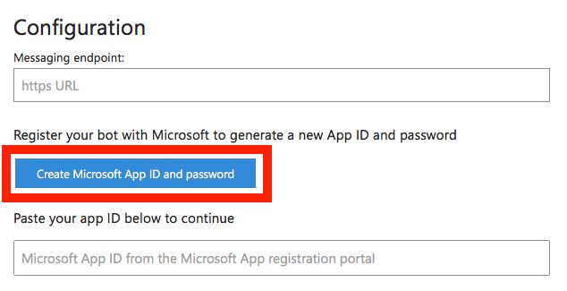
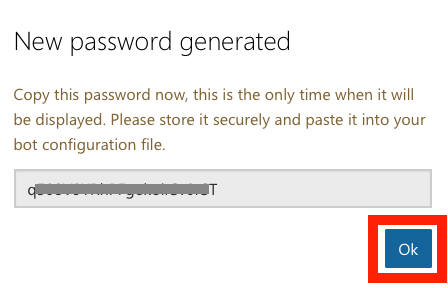
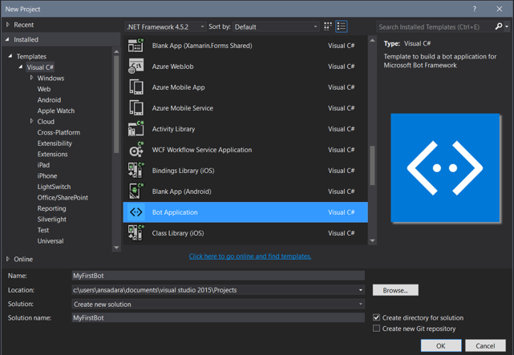
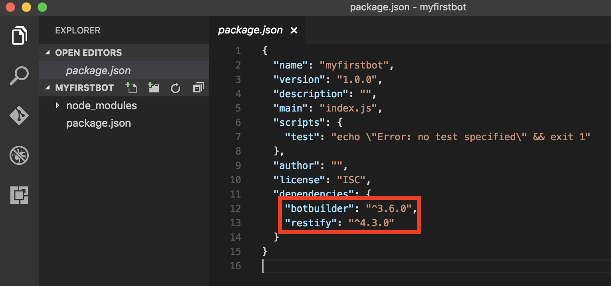
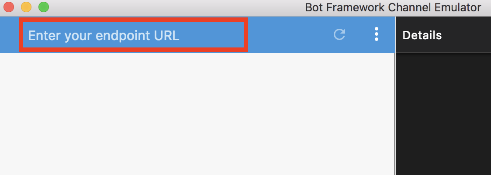
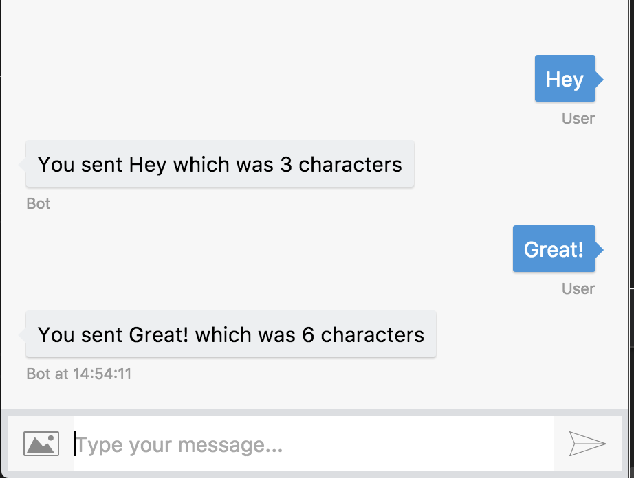
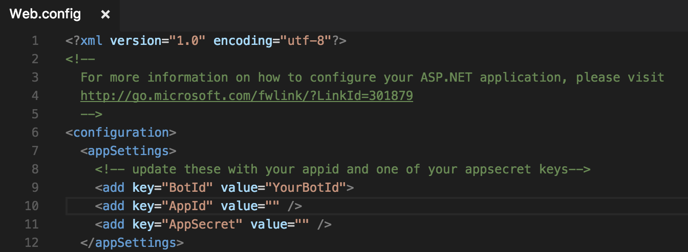
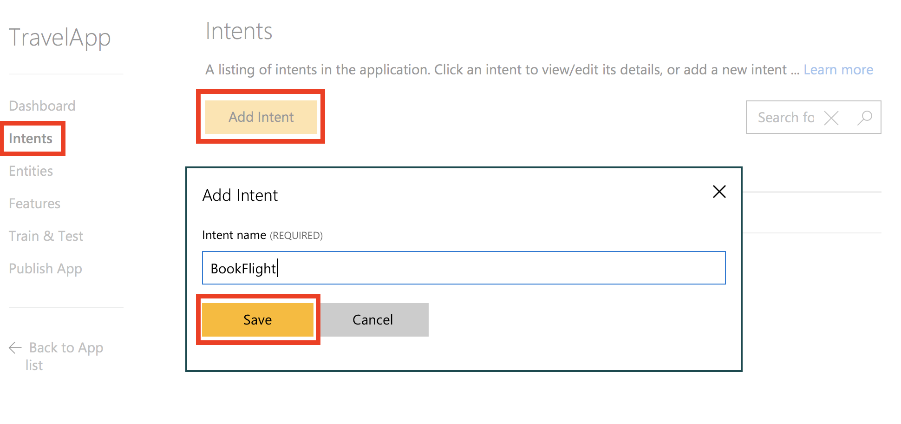
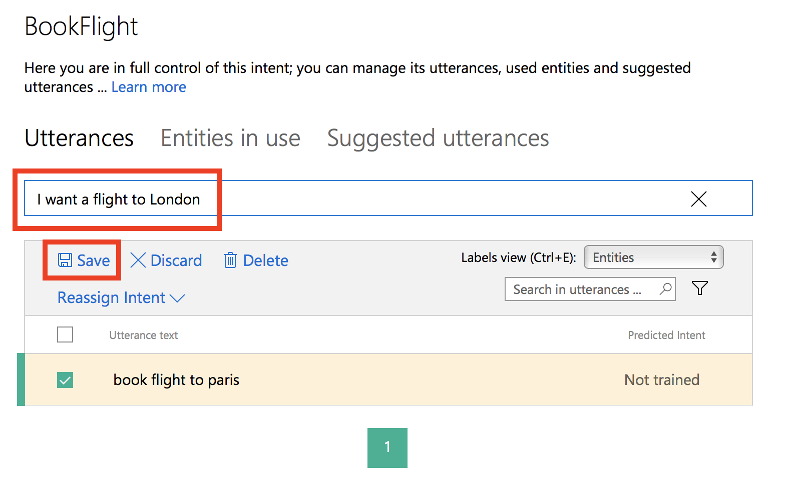
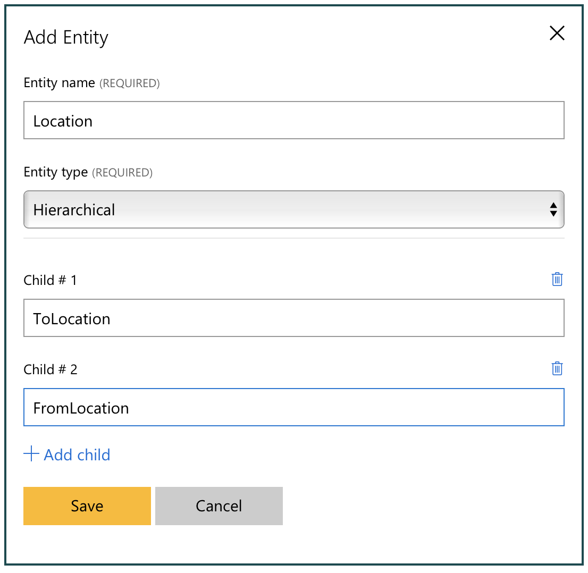

# Microsoft Bot Framework Workshop

By Lilian Kasem, February 2017

Credit for writing the original C# workshop:
- Darren Jefford
- Anthony Sadarangani
- Travis Hilbert


## Overview
Microsoft Bot Framework is a comprehensive offering to build and deploy high quality bots for your users to enjoy in their favorite conversation experiences. Developers writing bots all face the same problems: bots require basic I/O; they must have language and dialog skills; they must be performant, responsive and scalable; and they must connect to users – ideally in any conversation experience and language the user chooses. Bot Framework provides just what you need to build, connect, manage and publish intelligent bots that interact naturally wherever your users are talking – from text/sms to Skype, Slack, Facebook Messenger, Kik, Office 365 mail and other popular services. This lab will show you how to build a basic bot, connect it to a LUIS model, and get responses back.  

### Objectives
This lab will show you how to:
- Create an echo chat Bot
- Create a LUIS model
- Integrate a LUIS model into an existing Bot
- Use the Bot Freamwork Emulator to test your Bot

### System Requirements
You must have the following to complete this lab:
- Microsoft Visual Studio (latest update) 
- Bot Framework Emulator
- Bot Application Template (if using Windows)

## Contents
EXERCISE 1: CREATE A BOT
- Task 1 – [Register a Bot](#register-a-bot)
- Task 2 – Create a new Bot Application
    - [Click here for C#](#create-a-new-bot-application-in-csharp)
    - [Click here for Node](#create-a-new-bot-application-in-node)
- Task 3 – [Communicate with the bot in the Bot Emulator](#communicate-with-the-bot-in-the-bot-emulator)

EXERCISE 2: ADD A LUIS MODEL
- Task 1 – [Create a LUIS Application](#create-a-luis-application)
- Task 2 – [Adding Intents](#adding-intents)

EXERCISE 3: CONNECTING THE DOTS
- [In C#](#connecting-to-luis-in-csharp)
- [In Node](#connecting-to-luis-in-node)

## Setup
You must perform the following steps to prepare your computer for this lab:

First, install the [Bot Framework Emulator](https://aka.ms/bf-bc-emulator).

### C# (Windows 10)
1.	Install [Visual Studio 2015](https://www.visualstudio.com/vs/community)
    -  Update all VS extensions to their latest versions
2.	Install the [Bot Application Template](http://aka.ms/bf-bc-vstemplate)
    - Save in your VS template directory `%USERPROFILE%\Documents\Visual Studio 2015\Templates\ProjectTemplates\Visual C#`

### C# (Mac)
1.	Install [Visual Studio for Mac Preview](https://www.visualstudio.com/vs/visual-studio-mac)
2.	Download ‘MyFirstBot’ project from this [workshops GitHub repo](https://github.com/liliankasem/bot-workshop/tree/master/MyFirstBot)

### Node
1.	Install [Node JS](https://nodejs.org/en/)

## EXERCISE 1: CREATE A BOT

### Register a Bot
Before we begin, we need to register a new bot on the bot framework website.
- Go to https://dev.botframework.com/  and click “Register a bot” at the top of the screen. 


- Give your bot a name, a bot handle, and give it a small description.


- In the Configuration section, click “Create Microsoft App ID and password”. On the next page, your App ID will be displayed (write this down). 



- Click “Generate a password to continue”. Write down this password and keep it safe!  This is the only time the password will be displayed! Click “Ok” and then click “Finish and go back to Bot Framework” 




- Fill out the rest of the required fields. Then click “Register”. 

### Create a new Bot Application in CSharp
If you are doing this lab on a MacBook (OSX): as there is not currently a Bot Framework template for Visual Studio Mac, use the MyFirstBot project as your starting application for developing a C# bot on OSX. This application is exactly the same result you would get if you follow the steps below on Windows.

1. In a new instance of Visual Studio 2015, choose **File > New> Project** to open the New Project dialog. Navigate to **Installed > Templates > Visual C#** and select the **Bot Application** template.
 
    Name your project **MyFirstBot** and select the file system location where you will save your solutions. Leave the options selected to **Create new solution** and **Create directory for solution**.



2. Set your Solution Configuration to **Debug** and your Solution Platform to **Any CPU**. Select your favorite browser from the Debug Target dropdown menu. You can choose to debug/deploy on a phone device connected via USB outside of this lab.


3. Build and run your app. You will see a blank app browser tab displaying the applications Default.htm


**Keep note of the port your Bot is running on as well as the API URL to be used for testing your Bot. In this case, this is `http://localhost:3978/api/messages`**

### If you are doing this on a Macbook (OSX): 
When the application launches, you may see a 404 Error `System.Web.HttpException. The resource cannot be found`. Don't worry about this for now as the application still works and this doesn't prevent you from completing the lab.

Also notice your app is using port 8080. Keep a note of this as you will need to use this address in the bot emulator to communicate with your bot: `http://localhost:8080/api/messages`


### Create a new Bot Application in Node

1. Make sure you have Node JS install (link provided in setup section) 
2. Open terminal or command prompt
3. Make a new directory (the location you will store your bot application) and then change directory into that folder
    - In this case, I've created a new dicrecotry 'myfirstbot' in my Documents


4. Run `npm init` and fill out the fields. Generally, you can just hit enter all the way through. This will create an empty node project.


5. Run `npm install --save restify`. This will download the restify package required and save the dependacy to the `package.json` file. Restify is required as we need a server to listen for messages at a given port.

6. Open this project in your favourite IDE and you should be able to see the following structure:



package.json should also should you the dependencies we just installed.

Create a new file called `index.js` and paste the following code into it:

```javascript
var builder = require('botbuilder');
var restify = require('restify');

//=========================================================
// Bot Setup
//=========================================================

// Setup Restify Server
var server = restify.createServer();
server.listen(process.env.port || process.env.PORT || 3978, function () {
   console.log('%s listening to %s', server.name, server.url); 
});
  
// Create chat bot
var connector = new builder.ChatConnector({
    appId: process.env.MICROSOFT_APP_ID,
    appPassword: process.env.MICROSOFT_APP_PASSWORD
});
var bot = new builder.UniversalBot(connector);
server.post('/api/messages', connector.listen());

//=========================================================
// Bots Dialogs
//=========================================================

bot.dialog('/', function(session){
    session.send("You sent %s which was %d characters", session.message.text, session.message.text.length);
})

```

7. Build and run this project. You can do this in terminal or command promptt by calling `node index.js` and you should see the bot running at port t `3978`. The endpoint you need to communicate to your bo will be `http://localhost:3978/api/messages`


### Communicate with the bot in the Bot Emulator

1. Keep your bot application running from the previous steps and make a note of the endpoint
    - If you've already closed the application, run your bot application again
    - Depending on which steps you followed, you endpoint should be `http://localhost:3978/api/messages` or `http://localhost:8080/api/messages`
2. Open the Bot Emulator and enter your endpoint where it says "Enter your endpoint URL"



3. You should then see the same configuration settings as the image below. We go these details from the portol in Task 1. For now you can leave these blank and just press "Connect". If you type a message now, you should see your bot in action.




### Bonus
Remember these settings?


You can fill these fields in with the values we got when we registered our bot in Task 1. You will need to do this when you start live debugging with ngrok (you can find out more about this from the [documentation](https://docs.botframework.com/en-us/node/builder/guides/core-concepts/#debugging-locally-using-ngrok)). To do that, first you have to update your application with the App ID and Password too.

1. In C#, open `Web.config` and replace the `AppId` and `AppPassword` with the correct values from your [bot developer portal](https://dev.botframework.com/)



2. In Node, if your IDE supports environment variables you can use that as a way of setting the `AppId` and `AppPassword` (as shown in image 1). Otherwise, just replace the values in index.js (as shown in image 2).


## EXERCISE 2: ADD A LUIS MODEL

### Create a LUIS Application

1.	Go to [luis.ai](https://luis.ai) and log in. 
2.	Click “New App” in the top left corner of the page and click “New Application” from the drop down menu.


3. In the pop up, name your new LUIS model, give it a description, and choose the application culture. Next, click “Add App”. 


4. When your application is finished provisioning, it will take you to the main page of your new LUIS model. Next, you will train your Luis model.

### Adding Intents
Next, we will add two intents to the application.  

1. Click the “+” next to intents and make a “BookFlight” intent. Name it “BookFlight” and give it an example utterance, “Book flight to Paris”, then click save. 



2. Your utterance will come up for labelling. Make sure “BookFlight” is selected in the drop down menu and click “Submit” to submit the utterance to your LUIS app. 



3. Now add a second intent called “GetWeather”, with the example command of “How is the weather in London”. Click “Save”, and accept the presented utterance as a “GetWeather” intent and click “Submit”.

### Defining entities/Hierarchical entities 
You can have the ability to define relationships between entities based on hereditary hierarchical patterns. The generic entity acts as the parent and the children are the specific types/sub groups under the parent, yet both share the same characteristics. An example of this could be our Location.

1.	To add entities, click the “+” button next to the “Entities” section on the left of the screen, and name it “Location”. 
2.	Next, click “Include Children” and “Hierarchical” 
3.	Add a “ToLocation” entity.
4.	Next, click “+” next to “Entity Children” and add a “FromLocation” entity.   
5.	When finished, click “Save”. 


### Using Pre-Built Entities 
Next, we are going to add a Pre-Built datetime entity. 
1.	To add a Pre-Built Entity, click “+” next to “Pre-built Entities” at the left of the screen.
2.	Scroll down and select “datetime” from the lift of Pre-Built entities” 
3.	Then click “Ok”. It’s as easy as that. 




### Training your model
Now that we have the intents and entities defined, we now need to provide more examples of utterances that illustrate these concepts. Click the text box at the top of the screen and start typing in example utterances. You will need to input and label at least five examples of each intent in order to get an accurate model. 

Next click “Train”, located at the bottom left of the page, and wait for the completed message to appear. Then click “Publish” at the top left of the screen and click “Publish web service”. A URL will appear with your application id and your subscription key. Write these down and keep them safe. You will be using these later. 

Now it’s time to connect the dots. 

## EXERCISE 3: CONNECTING THE DOTS
This next section will show you how to connect all the dots together and get your bot to recognize utterances entered into the bot emulator.  

### Connecting to LUIS in CSharp

1. Go back to the echo bot you made earlier. Add a new folder and name it “TravelApp”. Inside that new file, add a new class named “LUISApp”. This is where the code for your LUIS model will live. 

2. Next, we need to add code that will handle LUIS intents that are triggered from phrases entered into the Bot Emulator. Insert the following code snippet into the LUISApp file. 

```csharp
using System;
using System.Collections.Generic;
using System.Linq;
using System.Threading.Tasks;
using Microsoft.Bot.Builder.Dialogs;
using Microsoft.Bot.Builder.Luis;
using Microsoft.Bot.Builder.Luis.Models;

namespace MyFirstBot.TravelApp
{
    [LuisModel("LUIS App ID", "Subscription Key")]
    [Serializable]
    public class LUISApp : LuisDialog<object>
    {
        //Will run when a None intent is Triggered
        [LuisIntent("")]
        public async Task None(IDialogContext context, LuisResult result)
        {
            //Add Custom code here.
            string message = $"No Intent";
            await context.PostAsync(message);
            context.Wait(MessageReceived);
        }

        //Will run when a GetWeather intent is Triggered
        [LuisIntent("GetWeather")]
        public async Task GetWeather(IDialogContext context, LuisResult result)
        {
            //Add Custom code here.
            string message = $"GetWeather Intent";
            await context.PostAsync(message);
            context.Wait(MessageReceived);
        }
        
        //Will run when a Bookflight intent is Triggered
        [LuisIntent("BookFlight")]
        public async Task BookFlight(IDialogContext context, LuisResult result)
        {
            //Add Custom code here.
            string message = $"BookFlight Intent";
            await context.PostAsync(message);
            context.Wait(MessageReceived);
        }
    }
}

```
3. Input your App ID and Subscription Key from your LUIS model. 

4. Next we need to edit the `MessageController.cs` file and replace your code with the following:

```csharp
[BotAuthentication]
public class MessagesController : ApiController
{
    public async Task<HttpResponseMessage> Post([FromBody]Activity activity)
    {
        if (activity.Type == ActivityTypes.Message){
            await Conversation.SendAsync(activity, () => new LUISApp());
        }
            
        var response = Request.CreateResponse(HttpStatusCode.OK);
        return response;
    }
}
```

5. Rebuild your code and run it. 

6. Go to the bot emulator and start entering test queries. When an intent of “GetWeather” is triggered, the bot will return “GetWeather”, and the intent of “BookFlight” will return “BookFlight”, and a “None” intent will return “No Intent”.  


### Connecting to LUIS in Node

1. Go back to the echo bot you made earlier and insert the following code into `index.js` (before the bot dialogs, and after `server.post('/api/messages', connector.listen());`)

```javascript
var model = process.env.LUIS_MODEL;
var recognizer = new builder.LuisRecognizer(model);
var intents = new builder.IntentDialog({ recognizers: [recognizer] });

bot.dialog('/', intents);
intents.matches('None', '/none')
.matches('GetWeather', '/getWeather')
.matches('BookFlight', '/bookFlight')
.onDefault(builder.DialogAction.send("I'm sorry. I didn't understand."))
``` 

2. You can either setup an environment variable called `LUIS_MODEL` with your LUIS endpoint or just replace `process.env.LUIS_MODEL;` in index.js

The above code has setup the LUIS model and matched our intents to dialogs in our application i.e. if the intent is `GetWeather` the `getWeather` bot dialog will be launched. Now we need to create the actaul dialogs that will be called.

3. Delete any existing dialogs you have in the `Bots Dialogs` section and copy in this code:

```javascript
bot.dialog('/none', function(session){
    session.send("No intent");
})

bot.dialog('/getWeather', function(session){
    //Add custom code here to implent get weather feature
    session.send("GetWeather intent");
})

bot.dialog('/bookFlight', function(session){
    //Add custom code here to implent book flight feature
    session.send("BookFlight intent");
})
```

4. Rebuild your code and run it. 

5. Go to the bot emulator and start entering test queries. When a intent of “GetWeather” is triggered, the bot will return a “GetWeather intent” message, intent of “BookFlight” will return “BookFlight intent”, and a “None” intent will return “No Intent”.  


